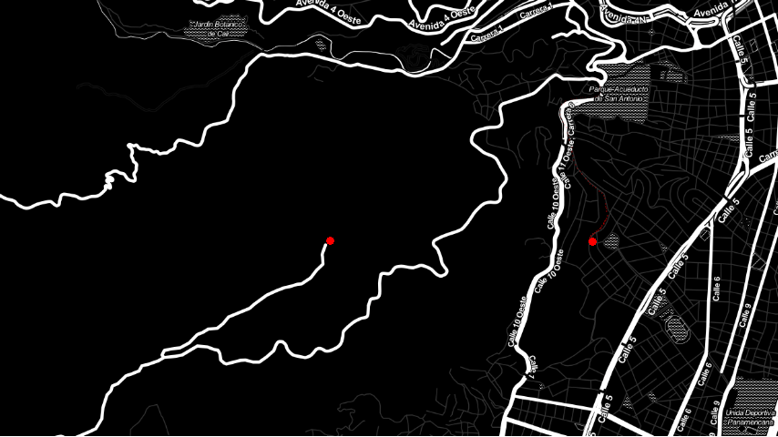
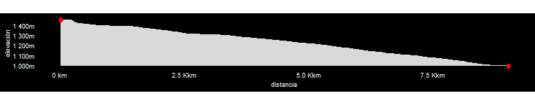

# cr_abajo

Mapa del descenso desde el monumento a Cristo Rey, en el cerro Los Cristales, en Cali - Colombia.

En este proyecto se usan datos en formato gpx de la [actividad](https://www.strava.com/activities/4407555425/segments/3103800653678209830) en Strava, para crear una animación con `gganimate` del trayecto y la curva de elevación contra distancia recorrida. Las animaciones fueron usadas en el video de Youtube [Cuesta abajo vol.01]() 

## Mapa y trayectoria

## Elevación vs Distnacia recorrida

[Basado en una respuesta de stackoverflow](https://stackoverflow.com/questions/68899833/how-to-create-animation-of-vehicle-moving-form-a-to-b-along-a-route)

Map tiles de [Stamen Design](http://stamen.com), bajo [CC BY 3.0](http://creativecommons.org/licenses/by/3.0). Datos de [OpenStreetMap](http://openstreetmap.org), bajo [ODbL](http://www.openstreetmap.org/copyright.